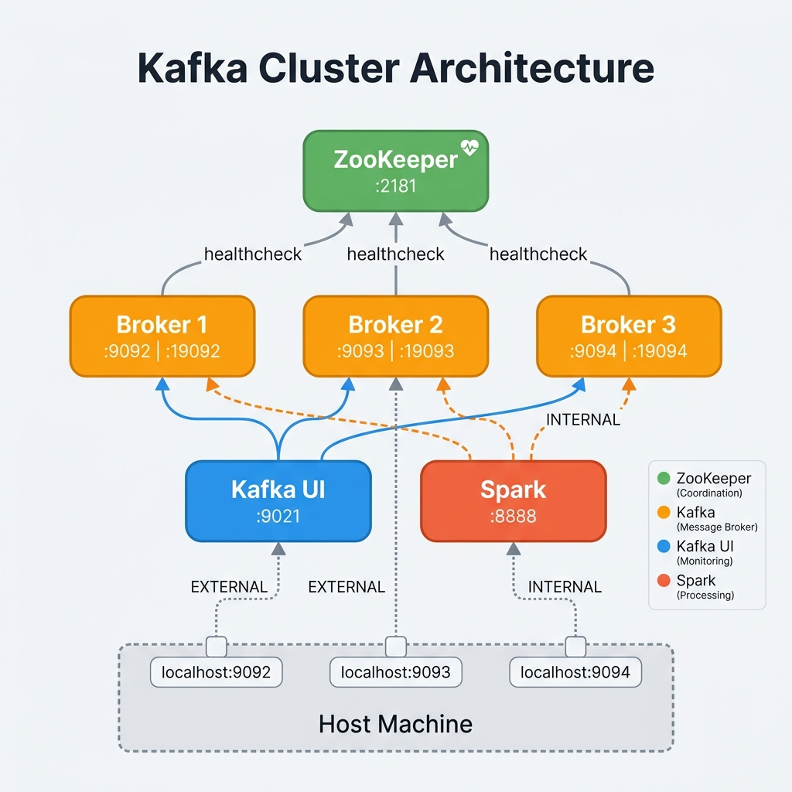

<p align="center">
  
</p>

<h1 align="center">Kafka Cluster — Docker Deployment</h1>

<p align="center">
  <strong>A production-ready, 3-broker Apache Kafka cluster with ZooKeeper, Kafka UI, designed for Big Data &amp; Spark Structured Streaming integration.</strong>
</p>

<p align="center">
  <a href="https://docs.confluent.io/platform/7.3/overview.html"></a>
  <a href="https://www.docker.com/"></a>
  <a href="https://spark.apache.org/"></a>
  <a href="LICENSE"></a>
</p>

---

## 📖 Table of Contents

- [Overview](#overview)
- [Architecture](#architecture)
- [Prerequisites](#prerequisites)
- [Quick Start](#quick-start)
- [Kafka UI](#kafka-ui)
- [Configuration](#configuration)
- [Networking & Listeners](#networking--listeners)
- [Spark Integration](#spark-integration)
- [Operations Guide](#operations-guide)
- [Troubleshooting](#troubleshooting)
- [Documentation](#documentation)
- [Port Reference](#port-reference)
- [Contributing](#contributing)
- [License](#license)

---

## Overview

This repository provides a **multi-broker Apache Kafka cluster** running on Docker Compose, purpose-built for:

- 🎓 **Learning** — Big Data and Data Engineering coursework
- 🔥 **Spark Structured Streaming** — Real-time data pipeline development
- 🧪 **Local Development** — Test Kafka producers/consumers without cloud infrastructure

### Key Features

| Feature | Description |
|---------|-------------|
| **3 Kafka Brokers** | Fault-tolerant cluster with replication support |
| **Kafka UI** | Web dashboard at `localhost:9021` for visual cluster management |
| **ZooKeeper Health Checks** | Kafka brokers wait until ZooKeeper is fully ready |
| **Extended Timeouts** | 60s session/connection timeouts to prevent crashes under load |
| **Multi-Listener Setup** | Internal (container-to-container), External (host), and Docker listeners |
| **Shared Network** | Pre-configured to join an external `itvdelabnw` network alongside Spark |

---

## Architecture

<p align="center">
  
</p>

```
┌─────────────────────────────────────────────────────────────────────┐
│                    Docker Network: itvdelabnw                       │
│                                                                     │
│  ┌──────────┐    ┌──────────┐   ┌──────────┐   ┌──────────┐       │
│  │          │    │          │   │          │   │          │       │
│  │  zoo1    │◄───│  kafka1  │   │  kafka2  │   │  kafka3  │       │
│  │ :2181    │◄───│ :19092   │   │ :19093   │   │ :19094   │       │
│  │          │◄───│          │   │          │   │          │       │
│  └──────────┘    └────┬─────┘   └────┬─────┘   └────┬─────┘       │
│                       │              │              │              │
│  ┌────────────────────┴──────────────┴──────────────┘              │
│  │  Spark Container (itvdelab) ── connects via INTERNAL listener  │
│  │  :8888 (Jupyter) | :4040 (Spark UI)                            │
│  └────────────────────────────────────────────────────────────────┘│
│                                                                     │
└──────────────────────────┬──────────────┬──────────────┬────────────┘
                           │              │              │
                      Host :9092     Host :9093     Host :9094
                      (EXTERNAL)     (EXTERNAL)     (EXTERNAL)
```

---

## Prerequisites

| Tool | Minimum Version | Check Command |
|------|----------------|---------------|
| **Docker** | 20.10+ | `docker --version` |
| **Docker Compose** | 2.0+ (V2) | `docker compose version` |
| **Network** | `itvdelabnw` must exist | `docker network ls` |

> [!IMPORTANT]
> The `itvdelabnw` Docker network must be created **before** starting this cluster.
> If you're running the Spark environment from the same course, this network is likely already created.

---

## Quick Start

### 1. Create the external network (if not already created)

```bash
docker network create itvdelabnw
```

### 2. Configure environment variables (optional)

```bash
cp .env.example .env
# Edit .env if your Docker host IP differs from 127.0.0.1
```

### 3. Start the cluster

```bash
docker compose up -d
```

### 4. Verify all services are healthy

```bash
# Check container status
docker compose ps

# Verify ZooKeeper health
docker exec zoo1 bash -c "echo ruok | nc localhost 2181"
# Expected output: imok

# Verify Kafka brokers are registered
docker exec kafka1 kafka-broker-api-versions --bootstrap-server kafka1:19092
```

### 5. Open Kafka UI

Open **[http://localhost:9021](http://localhost:9021)** in your browser to manage and monitor the cluster visually.

### 6. Create a test topic

```bash
docker exec kafka1 kafka-topics --create \
  --topic test-topic \
  --bootstrap-server kafka1:19092 \
  --partitions 3 \
  --replication-factor 3
```

### 7. Stop the cluster

```bash
docker compose down
```

---

## Kafka UI

> 🌐 **Access:** [http://localhost:9021](http://localhost:9021)

Kafka UI provides a web-based dashboard to manage topics, browse messages, monitor consumer groups, and produce test messages — all without CLI commands.

| Feature | Description |
|---------|-------------|
| 📊 **Dashboard** | Cluster overview — brokers, topics, partitions |
| 📝 **Topic Management** | Create, configure, delete topics via GUI |
| 📨 **Message Browser** | Read messages with filtering and search |
| ✉️ **Produce Messages** | Send test messages from the browser |
| 👥 **Consumer Groups** | Monitor lag, offsets, and membership |

> 📖 **Full Guide:** [docs/KAFKA-UI-GUIDE.md](docs/KAFKA-UI-GUIDE.md)

---

## Configuration

### Environment Variables

Create a `.env` file from the provided template:

```bash
cp .env.example .env
```

| Variable | Default | Description |
|----------|---------|-------------|
| `DOCKER_HOST_IP` | `127.0.0.1` | IP address for the EXTERNAL Kafka listener |

### ZooKeeper Configuration

| Parameter | Value | Purpose |
|-----------|-------|---------|
| `ZOOKEEPER_TICK_TIME` | `4000` | Base time unit (ms) — increased for stability under load |
| `ZOOKEEPER_MAX_CLIENT_CNXNS` | `0` | Unlimited client connections |
| `ZOOKEEPER_CLIENT_PORT` | `2181` | Client connection port |

### Kafka Broker Configuration

| Parameter | Value | Purpose |
|-----------|-------|---------|
| `KAFKA_ZOOKEEPER_SESSION_TIMEOUT_MS` | `60000` | ZK session timeout — prevents crashes under resource pressure |
| `KAFKA_ZOOKEEPER_CONNECTION_TIMEOUT_MS` | `60000` | ZK connection timeout — allows slow startup |
| `KAFKA_ALLOW_EVERYONE_IF_NO_ACL_FOUND` | `true` | Permits access without ACL rules (development only) |

> [!WARNING]
> `KAFKA_ALLOW_EVERYONE_IF_NO_ACL_FOUND: true` disables authorization.
> **Do not use this setting in production.** Configure proper ACLs for any non-local deployment.

---

## Networking & Listeners

Each Kafka broker is configured with **three listeners** to support different access patterns:

| Listener | Protocol | Use Case | Bootstrap Servers |
|----------|----------|----------|-------------------|
| **INTERNAL** | `PLAINTEXT` | Container-to-container (Spark ↔ Kafka) | `kafka1:19092,kafka2:19093,kafka3:19094` |
| **EXTERNAL** | `PLAINTEXT` | Host machine access | `localhost:9092,localhost:9093,localhost:9094` |
| **DOCKER** | `PLAINTEXT` | Docker Desktop inter-VM | `host.docker.internal:29092,29093,29094` |

### Which listener should I use?

```
┌──────────────────────────────────────┐
│ Where is your client running?        │
├──────────────────────────────────────┤
│                                      │
│  Inside Docker (same network)?       │
│  └─► Use INTERNAL listener           │
│      kafka1:19092                    │
│                                      │
│  On your host machine?               │
│  └─► Use EXTERNAL listener           │
│      localhost:9092                   │
│                                      │
│  In Docker Desktop (different VM)?   │
│  └─► Use DOCKER listener             │
│      host.docker.internal:29092      │
│                                      │
└──────────────────────────────────────┘
```

---

## Spark Integration

### Prerequisites

The Spark container must be on the same `itvdelabnw` Docker network. Verify:

```bash
docker network inspect itvdelabnw --format '{{range .Containers}}{{.Name}} {{end}}'
```

### Launch PySpark with Kafka Support

```bash
# Replace version numbers to match your Spark/Scala versions
pyspark --packages org.apache.spark:spark-sql-kafka-0-10_2.12:3.5.0
```

### Example: Structured Streaming Consumer

```python
from pyspark.sql import SparkSession
from pyspark.sql.functions import col, from_json, expr
from pyspark.sql.types import StructType, StringType

spark = SparkSession.builder \
    .appName("KafkaStructuredStreaming") \
    .getOrCreate()

# Read stream from Kafka (use INTERNAL listener from Spark container)
raw_stream = spark.readStream \
    .format("kafka") \
    .option("kafka.bootstrap.servers", "kafka1:19092,kafka2:19093,kafka3:19094") \
    .option("subscribe", "my-topic") \
    .option("startingOffsets", "earliest") \
    .load()

# Parse key/value as strings
parsed = raw_stream.selectExpr(
    "CAST(key AS STRING) AS key",
    "CAST(value AS STRING) AS value",
    "topic",
    "partition",
    "offset",
    "timestamp"
)

# Write to console for debugging
query = parsed.writeStream \
    .format("console") \
    .outputMode("append") \
    .option("truncate", False) \
    .start()

query.awaitTermination()
```

### Example: Kafka Producer (Python)

```python
from kafka import KafkaProducer
import json

producer = KafkaProducer(
    bootstrap_servers=['localhost:9092', 'localhost:9093', 'localhost:9094'],
    value_serializer=lambda v: json.dumps(v).encode('utf-8')
)

# Send a message
producer.send('my-topic', {'event': 'user_signup', 'user_id': 42})
producer.flush()
producer.close()
```

---

## Operations Guide

### Topic Management

```bash
# List all topics
docker exec kafka1 kafka-topics --list --bootstrap-server kafka1:19092

# Create a topic
docker exec kafka1 kafka-topics --create \
  --topic my-topic \
  --bootstrap-server kafka1:19092 \
  --partitions 3 \
  --replication-factor 3

# Describe a topic
docker exec kafka1 kafka-topics --describe \
  --topic my-topic \
  --bootstrap-server kafka1:19092

# Delete a topic
docker exec kafka1 kafka-topics --delete \
  --topic my-topic \
  --bootstrap-server kafka1:19092
```

### Console Producer & Consumer

```bash
# Produce messages interactively
docker exec -it kafka1 kafka-console-producer \
  --topic my-topic \
  --bootstrap-server kafka1:19092

# Consume messages from the beginning
docker exec kafka1 kafka-console-consumer \
  --topic my-topic \
  --bootstrap-server kafka1:19092 \
  --from-beginning
```

### Consumer Groups

```bash
# List consumer groups
docker exec kafka1 kafka-consumer-groups --list \
  --bootstrap-server kafka1:19092

# Describe a consumer group (check lag)
docker exec kafka1 kafka-consumer-groups --describe \
  --group my-group \
  --bootstrap-server kafka1:19092
```

### Health Monitoring

```bash
# Check ZooKeeper status
docker exec zoo1 bash -c "echo stat | nc localhost 2181"

# Check broker cluster metadata
docker exec kafka1 kafka-metadata --snapshot /var/lib/kafka/data/__cluster_metadata-0/00000000000000000000.log --cluster-id 2>/dev/null || echo "Use broker-api-versions instead"

# View broker logs
docker logs kafka1 --tail 50 --follow
```

---

## Troubleshooting

<details>
<summary><strong>❌ ZooKeeper Session Expired / Timeout</strong></summary>

**Symptoms:**
```
ERROR Exiting Kafka due to fatal exception during startup.
SessionExpiredException: KeeperErrorCode = Session expired
```

**Cause:** Resource pressure on the Docker host — ZooKeeper cannot respond within the session timeout.

**Fix:**
1. Ensure `KAFKA_ZOOKEEPER_SESSION_TIMEOUT_MS` is set to at least `60000` (already configured)
2. Increase Docker Desktop memory allocation (Settings → Resources → Memory ≥ 8 GB)
3. Stop unnecessary containers to free resources
4. Restart cleanly: `docker compose down && docker compose up -d`

</details>

<details>
<summary><strong>❌ Network 'itvdelabnw' not found</strong></summary>

**Symptoms:**
```
Network itvdelabnw declared as external, but could not be found
```

**Fix:**
```bash
docker network create itvdelabnw
```

</details>

<details>
<summary><strong>❌ AnalysisException: Failed to find data source 'kafka'</strong></summary>

**Cause:** Spark's Kafka connector JAR is not loaded.

**Fix:** Add `--packages` when launching Spark:
```bash
pyspark --packages org.apache.spark:spark-sql-kafka-0-10_2.12:3.5.0
```

> Ensure the Scala version (`2.12`) and Spark version (`3.5.0`) match your environment.

</details>

<details>
<summary><strong>❌ Connection Refused from Spark</strong></summary>

**Cause:** Using `localhost:9092` from inside a Docker container. `localhost` refers to the Spark container itself, not the Kafka brokers.

**Fix:** Use the INTERNAL listener addresses:
```python
.option("kafka.bootstrap.servers", "kafka1:19092,kafka2:19093,kafka3:19094")
```

</details>

<details>
<summary><strong>❌ Broker keeps restarting / crash loop</strong></summary>

**Fix:**
```bash
# Stop everything and remove old volumes
docker compose down -v

# Restart fresh
docker compose up -d
```

</details>

---

## Port Reference

| Service | Container Port | Host Port | Protocol | Purpose |
|---------|---------------|-----------|----------|---------|
| `zoo1` | 2181 | 2181 | TCP | ZooKeeper client connections |
| `kafka1` | 19092 | — | TCP | Internal broker communication |
| `kafka1` | 9092 | 9092 | TCP | External client access |
| `kafka1` | 29092 | 29092 | TCP | Docker Desktop access |
| `kafka2` | 19093 | — | TCP | Internal broker communication |
| `kafka2` | 9093 | 9093 | TCP | External client access |
| `kafka2` | 29093 | 29093 | TCP | Docker Desktop access |
| `kafka3` | 19094 | — | TCP | Internal broker communication |
| `kafka3` | 9094 | 9094 | TCP | External client access |
| `kafka3` | 29094 | 29094 | TCP | Docker Desktop access |
| `kafka-ui` | 8080 | 9021 | TCP | Web management dashboard |

---

## Documentation

| Document | Description |
|----------|-------------|
| [Architecture Overview](docs/ARCHITECTURE.md) | Component diagrams, data flow, and network topology |
| [Kafka UI Guide](docs/KAFKA-UI-GUIDE.md) | Full guide for the web dashboard on port `9021` |
| [Spark Integration](docs/SPARK-INTEGRATION.md) | PySpark examples and connectivity setup |
| [Data Pipeline Patterns](docs/DATA-PIPELINE-PATTERNS.md) | 6 streaming/ETL/CDC architectures with Mermaid diagrams |
| [Operations Guide](docs/OPERATIONS.md) | Day-to-day management, monitoring, and troubleshooting |
| [Security Hardening](docs/SECURITY.md) | SASL, TLS, ACLs, and production security checklist |
| [Example Scripts](examples/README.md) | Runnable Python producer, consumer, and Spark streaming code |
| [Makefile](Makefile) | Convenient CLI shortcuts for all cluster operations |
| [Contributing](CONTRIBUTING.md) | How to contribute to this project |
| [Changelog](CHANGELOG.md) | Version history and release notes |

---

## Contributing

Contributions are welcome! Please read the [Contributing Guide](CONTRIBUTING.md) for details on the process.

---

## License

This project is licensed under the MIT License — see the [LICENSE](LICENSE) file for details.

---

<p align="center">
  <sub>Built with ❤️ for the Data Engineering Diploma — Big Data Track</sub>
</p>
