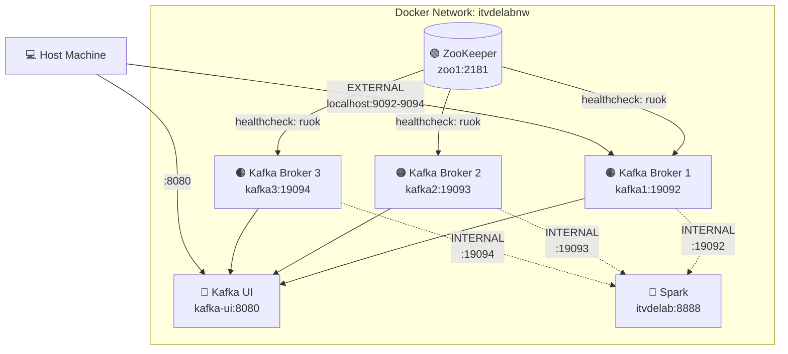
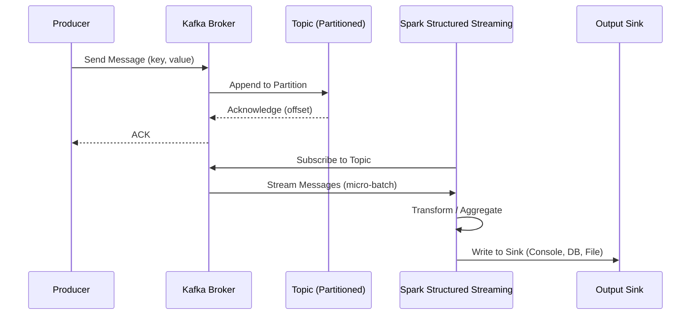
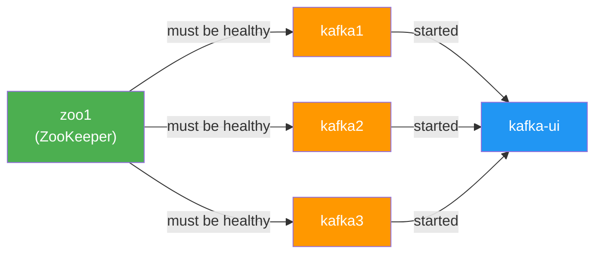

# 🏗️ Architecture Overview

> **Cluster Topology:** 1 ZooKeeper + 3 Kafka Brokers + Kafka UI + Spark Integration

---

## Architecture Infographic

---

## Component Diagram

---

## Data Flow

---

## Service Dependencies

**Startup Order:**
1. ✅ `zoo1` starts and becomes healthy (healthcheck passes)
2. ✅ `kafka1`, `kafka2`, `kafka3` start simultaneously (after ZK healthy)
3. ✅ `kafka-ui` starts (after all 3 brokers are running)

---

## Network Topology

| Layer | Listener | Port Range | Access From |
|-------|----------|------------|-------------|
| **INTERNAL** | `kafkaX:190XX` | 19092–19094 | Other containers on `itvdelabnw` |
| **EXTERNAL** | `localhost:90XX` | 9092–9094 | Host machine |
| **DOCKER** | `host.docker.internal:290XX` | 29092–29094 | Docker Desktop VMs |

---

## Resource Allocation

| Service | Image | Memory (approx.) | CPU |
|---------|-------|-------------------|-----|
| ZooKeeper | `cp-zookeeper:7.3.2` | 256–512 MB | Low |
| Kafka Broker (×3) | `cp-kafka:7.3.2` | 1–2 GB each | Medium |
| Kafka UI | `kafka-ui:latest` | 256–512 MB | Low |
| **Total** | — | **~4–8 GB** | — |

> [!TIP]
> Allocate at least **8 GB RAM** to Docker Desktop for smooth operation with Spark running alongside.
