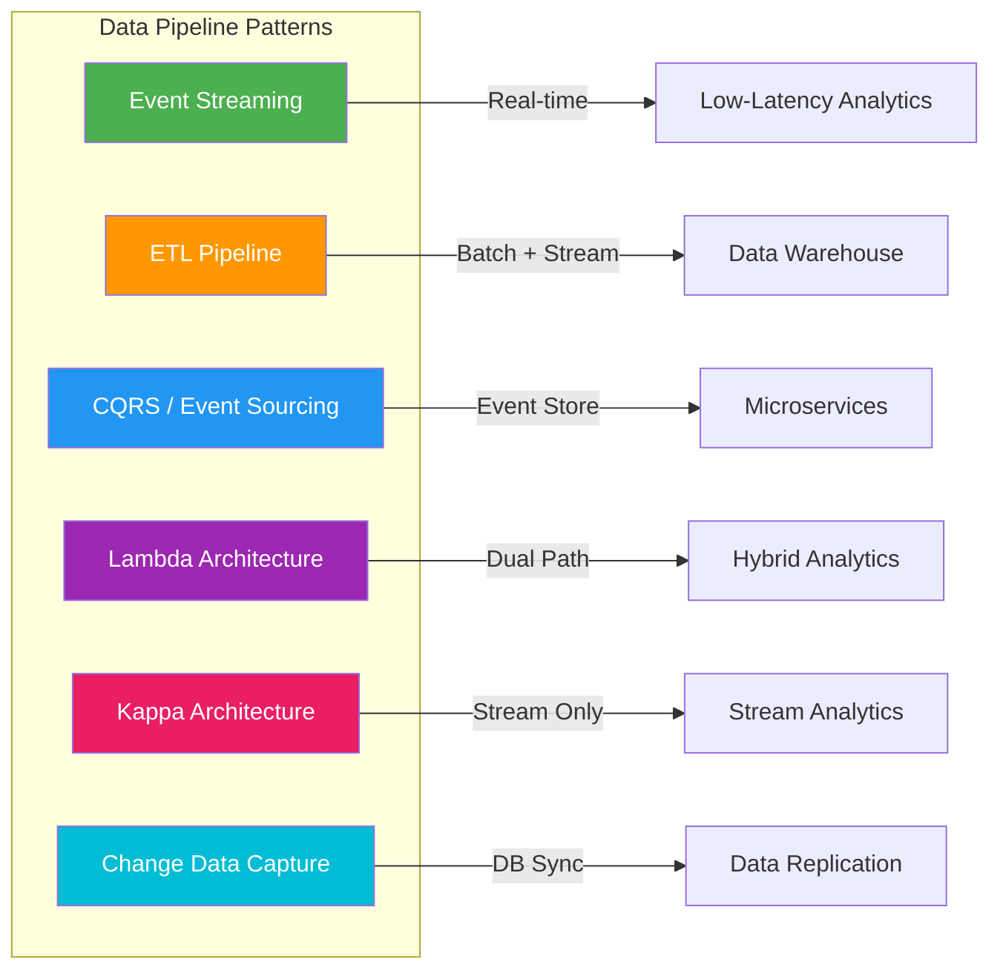
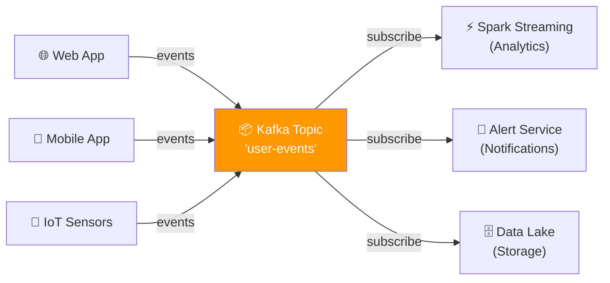
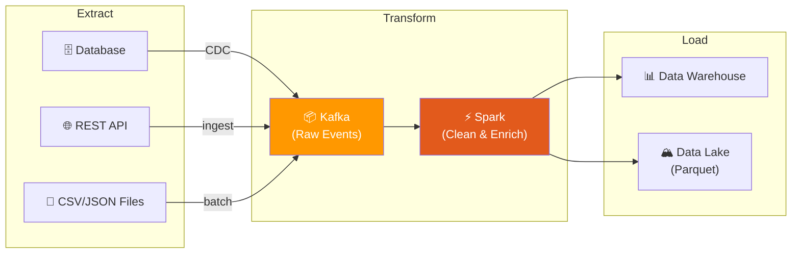
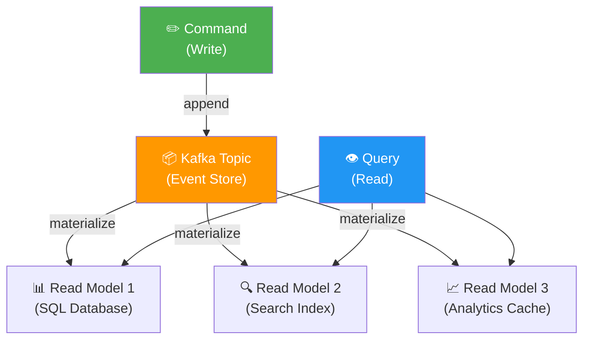
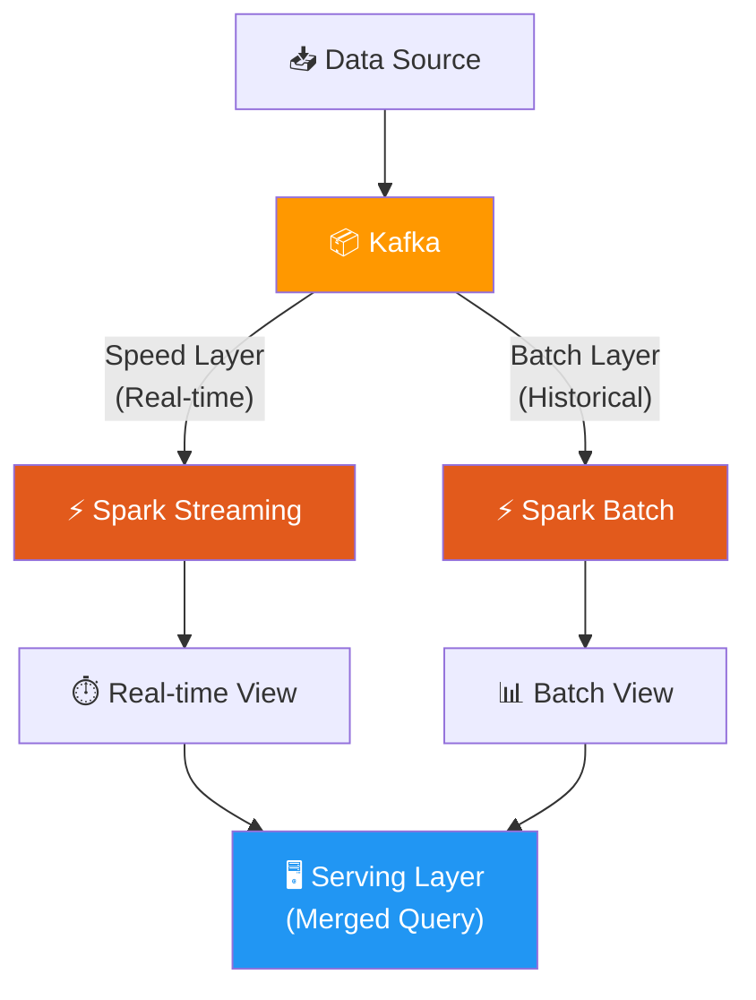
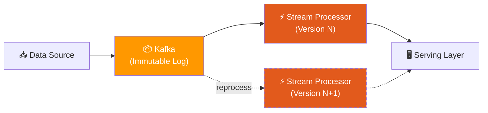
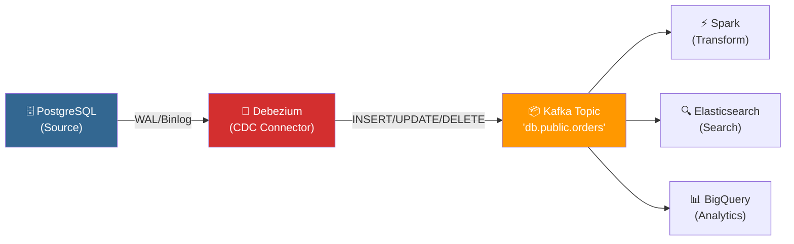
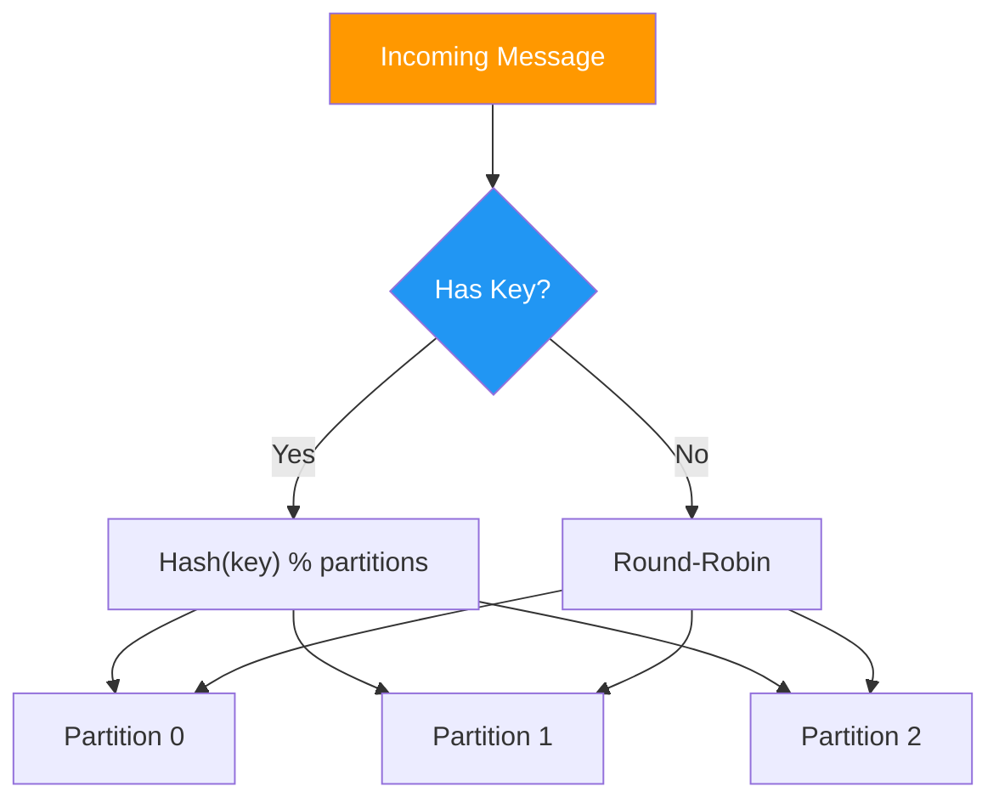

# 📊 Data Pipeline Patterns with Kafka

> Common architectures for building real-time and batch data pipelines using Kafka and Spark.

---

## Table of Contents

- [Pattern Overview](#pattern-overview)
- [1. Event Streaming Pipeline](#1-event-streaming-pipeline)
- [2. ETL Pipeline (Extract → Transform → Load)](#2-etl-pipeline)
- [3. CQRS & Event Sourcing](#3-cqrs--event-sourcing)
- [4. Lambda Architecture](#4-lambda-architecture)
- [5. Kappa Architecture](#5-kappa-architecture)
- [6. CDC (Change Data Capture)](#6-cdc-change-data-capture)
- [Best Practices](#best-practices)

---

## Pattern Overview



---

## 1. Event Streaming Pipeline

The simplest and most common pattern. Producers emit events → Kafka stores them → Consumers process them in real time.



**When to use:**
- Real-time dashboards and monitoring
- Event-driven microservices
- User activity tracking

**Implementation with this cluster:**
```bash
# Create the topic
make topic TOPIC=user-events PARTITIONS=6

# Run the example producer
python examples/producer.py

# Run the Spark streaming consumer
spark-submit --packages org.apache.spark:spark-sql-kafka-0-10_2.12:3.5.0 \
  examples/spark_streaming.py
```

---

## 2. ETL Pipeline

Extract from sources → Transform with Spark → Load into a data warehouse or data lake.



**Key considerations:**
- Use Kafka as a buffer between extract and transform stages
- Spark handles both micro-batch and batch processing
- Write to Parquet for efficient columnar storage

---

## 3. CQRS & Event Sourcing

Separate write (command) and read (query) paths. Kafka acts as the immutable event log.



**When to use:**
- High-read, low-write workloads
- Need for multiple read optimized views
- Audit trail requirements

**Kafka configuration:**
```bash
# Long retention for event store (30 days)
docker exec kafka1 kafka-configs --alter \
  --entity-type topics --entity-name orders \
  --add-config retention.ms=2592000000 \
  --bootstrap-server kafka1:19092

# Or infinite retention (log compaction)
docker exec kafka1 kafka-configs --alter \
  --entity-type topics --entity-name orders \
  --add-config cleanup.policy=compact \
  --bootstrap-server kafka1:19092
```

---

## 4. Lambda Architecture

Dual-path processing: a **batch layer** for accuracy and a **speed layer** for low latency.



**Trade-offs:**
| Aspect | Pros | Cons |
|--------|------|------|
| Accuracy | Batch corrects streaming errors | Two codebases to maintain |
| Latency | Speed layer provides real-time | Complexity of merging views |
| Cost | Handles reprocessing | Higher infrastructure cost |

---

## 5. Kappa Architecture

**Stream-only** approach — eliminates the batch layer. All processing goes through Kafka streams.



**When to use over Lambda:**
- Simpler operational model (one codebase)
- Kafka retention is long enough to reprocess
- Eventual consistency is acceptable

**Kafka retention for reprocessing:**
```bash
# Set 7-day retention to allow full reprocessing
make topic TOPIC=events PARTITIONS=12
docker exec kafka1 kafka-configs --alter \
  --entity-type topics --entity-name events \
  --add-config retention.ms=604800000 \
  --bootstrap-server kafka1:19092
```

---

## 6. CDC (Change Data Capture)

Capture database changes and stream them through Kafka using Debezium or similar connectors.



**When to use:**
- Replicate databases to data lakes in real-time
- Keep search indexes in sync
- Feed analytics from operational databases

---

## Best Practices

### Topic Design

| Guideline | Recommendation |
|-----------|----------------|
| **Naming** | `<domain>.<entity>.<version>` (e.g., `ecommerce.orders.v1`) |
| **Partitions** | `2× max consumer parallelism` |
| **Replication** | `min(3, number_of_brokers)` |
| **Retention** | 7 days default; longer for event sourcing |
| **Key selection** | Use entity ID for ordering guarantees |

### Message Schema

```json
{
  "schema_version": "1.0",
  "event_type": "order.created",
  "event_id": "uuid-v4",
  "timestamp": "2026-08-09T15:00:00Z",
  "source": "order-service",
  "data": {
    "order_id": 12345,
    "customer_id": 6789,
    "total": 99.99
  },
  "metadata": {
    "correlation_id": "req-abc-123",
    "trace_id": "span-xyz-456"
  }
}
```

### Partitioning Strategy



> [!TIP]
> **Same key → same partition → guaranteed ordering.** Use customer_id or order_id as the key to ensure all events for an entity are processed in order.
