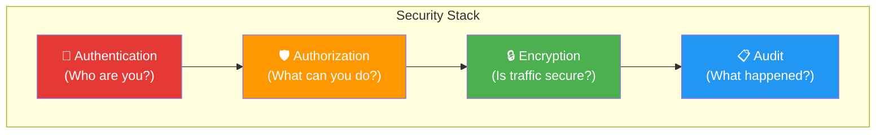

# 🔒 Security Hardening Guide

> This guide covers how to secure the Kafka cluster for staging and production environments.

---

## Current State (Development)

This cluster ships with **security disabled** for ease of local development:

```yaml
KAFKA_ALLOW_EVERYONE_IF_NO_ACL_FOUND: "true"   # No authorization
KAFKA_LISTENER_SECURITY_PROTOCOL_MAP: ...PLAINTEXT  # No encryption
```

> [!CAUTION]
> **Never deploy this configuration to production.** All traffic is unencrypted and unauthenticated.

---

## Security Layers



---

## 1. Authentication (SASL/SCRAM)

### Enable SASL/SCRAM-SHA-512

Add to each Kafka broker's environment:

```yaml
environment:
  KAFKA_LISTENER_SECURITY_PROTOCOL_MAP: INTERNAL:SASL_PLAINTEXT,EXTERNAL:SASL_PLAINTEXT
  KAFKA_SASL_MECHANISM_INTER_BROKER_PROTOCOL: SCRAM-SHA-512
  KAFKA_SASL_ENABLED_MECHANISMS: SCRAM-SHA-512
```

### Create Users

```bash
# Create admin user
docker exec kafka1 kafka-configs --zookeeper zoo1:2181 \
  --alter --add-config 'SCRAM-SHA-512=[password=admin-secret]' \
  --entity-type users --entity-name admin

# Create application user
docker exec kafka1 kafka-configs --zookeeper zoo1:2181 \
  --alter --add-config 'SCRAM-SHA-512=[password=app-secret]' \
  --entity-type users --entity-name spark-app
```

---

## 2. Authorization (ACLs)

### Disable Open Access

```yaml
KAFKA_ALLOW_EVERYONE_IF_NO_ACL_FOUND: "false"
```

### Define ACLs

```bash
# Allow spark-app to read from events topic
docker exec kafka1 kafka-acls --bootstrap-server kafka1:19092 \
  --add --allow-principal User:spark-app \
  --operation Read --topic events --group spark-group

# Allow producer-app to write to events topic
docker exec kafka1 kafka-acls --bootstrap-server kafka1:19092 \
  --add --allow-principal User:producer-app \
  --operation Write --topic events
```

### List ACLs

```bash
docker exec kafka1 kafka-acls --bootstrap-server kafka1:19092 --list
```

---

## 3. Encryption (TLS/SSL)

### Generate Certificates

```bash
# Generate CA
openssl req -new -x509 -keyout ca-key -out ca-cert -days 365 -subj "/CN=KafkaCA"

# Generate broker keystore
keytool -keystore kafka.server.keystore.jks -alias kafka1 \
  -genkey -keyalg RSA -validity 365 -storepass changeit
```

### Enable TLS Listeners

```yaml
environment:
  KAFKA_LISTENER_SECURITY_PROTOCOL_MAP: INTERNAL:SSL,EXTERNAL:SSL
  KAFKA_SSL_KEYSTORE_LOCATION: /etc/kafka/secrets/kafka.server.keystore.jks
  KAFKA_SSL_KEYSTORE_PASSWORD: changeit
  KAFKA_SSL_TRUSTSTORE_LOCATION: /etc/kafka/secrets/kafka.server.truststore.jks
  KAFKA_SSL_TRUSTSTORE_PASSWORD: changeit
```

---

## 4. ZooKeeper Security

### Enable SASL for ZooKeeper

```yaml
# zoo1 environment
environment:
  KAFKA_OPTS: >-
    -Djava.security.auth.login.config=/etc/kafka/zookeeper_jaas.conf
    -Dzookeeper.authProvider.1=org.apache.zookeeper.server.auth.SASLAuthenticationProvider
```

### Restrict 4-Letter Words

Only whitelist what you need:

```yaml
KAFKA_OPTS: "-Dzookeeper.4lw.commands.whitelist=ruok,srvr"
```

---

## 5. Network Security

### Restrict Docker Network

```yaml
networks:
  itvdelabnw:
    driver: bridge
    internal: true  # No external access
    ipam:
      config:
        - subnet: 172.20.0.0/24
```

### Firewall Rules (Host)

```bash
# Only allow localhost access to Kafka ports
iptables -A INPUT -p tcp --dport 9092:9094 -s 127.0.0.1 -j ACCEPT
iptables -A INPUT -p tcp --dport 9092:9094 -j DROP
```

---

## Security Checklist

| # | Task | Priority | Status |
|---|------|----------|--------|
| 1 | Enable SASL authentication | 🔴 Critical | ⬜ |
| 2 | Set `ALLOW_EVERYONE_IF_NO_ACL_FOUND: false` | 🔴 Critical | ⬜ |
| 3 | Configure TLS encryption | 🔴 Critical | ⬜ |
| 4 | Define per-user ACLs | 🟠 High | ⬜ |
| 5 | Secure ZooKeeper with SASL | 🟠 High | ⬜ |
| 6 | Restrict Docker network | 🟡 Medium | ⬜ |
| 7 | Enable audit logging | 🟡 Medium | ⬜ |
| 8 | Rotate certificates regularly | 🟡 Medium | ⬜ |
| 9 | Set up monitoring alerts | 🟢 Low | ⬜ |
| 10 | Document incident response plan | 🟢 Low | ⬜ |
