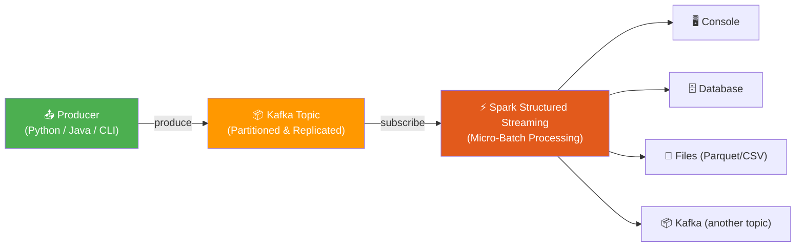

# 🔥 Spark Integration Guide

> Connect Apache Spark Structured Streaming to this Kafka cluster for real-time data processing.

---

## Prerequisites

| Requirement | Details |
|-------------|---------|
| Spark container on `itvdelabnw` | Must share the same Docker network |
| `spark-sql-kafka` package | Not included by default — must be added at runtime |
| Matching versions | Spark, Scala, and the connector must be version-aligned |

### Verify Network Connectivity

```bash
# Confirm both Spark and Kafka are on the same network
docker network inspect itvdelabnw --format '{{range .Containers}}{{.Name}} {{end}}'
# Should list: zoo1 kafka1 kafka2 kafka3 kafka-ui spark-...-itvdelab-1
```

---

## Bootstrap Server Reference

| From Where | Bootstrap Servers | When to Use |
|------------|-------------------|-------------|
| **Inside Docker** (Spark container) | `kafka1:19092,kafka2:19093,kafka3:19094` | ✅ Default for Spark |
| **Host machine** | `localhost:9092,localhost:9093,localhost:9094` | Local scripts, tools |
| **Docker Desktop VM** | `host.docker.internal:29092,29093,29094` | Cross-VM access |

> [!IMPORTANT]
> From the Spark container, always use the **INTERNAL** listener (`kafka1:19092`).
> Using `localhost` will fail because it refers to the Spark container itself.

---

## Setup

### Option 1: PySpark Shell

```bash
pyspark --packages org.apache.spark:spark-sql-kafka-0-10_2.12:3.5.0
```

### Option 2: spark-submit

```bash
spark-submit \
  --packages org.apache.spark:spark-sql-kafka-0-10_2.12:3.5.0 \
  your_streaming_app.py
```

### Option 3: SparkSession Config (in code)

```python
spark = SparkSession.builder \
    .appName("KafkaApp") \
    .config("spark.jars.packages", "org.apache.spark:spark-sql-kafka-0-10_2.12:3.5.0") \
    .getOrCreate()
```

> [!TIP]
> To find your Spark and Scala versions:
> ```bash
> spark-submit --version
> ```

---

## Examples

### 1. Basic Consumer (Read from Kafka)

```python
from pyspark.sql import SparkSession

spark = SparkSession.builder \
    .appName("KafkaConsumer") \
    .getOrCreate()

# Read stream
df = spark.readStream \
    .format("kafka") \
    .option("kafka.bootstrap.servers", "kafka1:19092,kafka2:19093,kafka3:19094") \
    .option("subscribe", "events") \
    .option("startingOffsets", "earliest") \
    .load()

# Decode key and value from binary
parsed = df.selectExpr(
    "CAST(key AS STRING) AS key",
    "CAST(value AS STRING) AS value",
    "topic",
    "partition",
    "offset",
    "timestamp"
)

# Output to console
query = parsed.writeStream \
    .format("console") \
    .outputMode("append") \
    .option("truncate", False) \
    .start()

query.awaitTermination()
```

### 2. JSON Parsing

```python
from pyspark.sql.functions import from_json, col
from pyspark.sql.types import StructType, StringType, IntegerType, TimestampType

# Define schema matching your Kafka messages
schema = StructType() \
    .add("user_id", IntegerType()) \
    .add("action", StringType()) \
    .add("timestamp", TimestampType())

# Parse JSON from Kafka value
events = df.select(
    col("key").cast("string"),
    from_json(col("value").cast("string"), schema).alias("data")
).select("key", "data.*")

# Write parsed data
query = events.writeStream \
    .format("console") \
    .outputMode("append") \
    .start()
```

### 3. Windowed Aggregation

```python
from pyspark.sql.functions import window, count

# Count events per 5-minute window
windowed = events \
    .withWatermark("timestamp", "10 minutes") \
    .groupBy(
        window("timestamp", "5 minutes"),
        "action"
    ).agg(count("*").alias("event_count"))

query = windowed.writeStream \
    .format("console") \
    .outputMode("update") \
    .start()
```

### 4. Write Back to Kafka (Sink)

```python
# Write processed data back to a different Kafka topic
output = events.selectExpr(
    "CAST(user_id AS STRING) AS key",
    "to_json(struct(*)) AS value"
)

query = output.writeStream \
    .format("kafka") \
    .option("kafka.bootstrap.servers", "kafka1:19092,kafka2:19093,kafka3:19094") \
    .option("topic", "processed-events") \
    .option("checkpointLocation", "/tmp/kafka-checkpoint") \
    .start()
```

### 5. Batch Read (Non-Streaming)

```python
# Read a snapshot of the topic (not streaming)
batch_df = spark.read \
    .format("kafka") \
    .option("kafka.bootstrap.servers", "kafka1:19092,kafka2:19093,kafka3:19094") \
    .option("subscribe", "events") \
    .option("startingOffsets", "earliest") \
    .option("endingOffsets", "latest") \
    .load()

batch_df.selectExpr("CAST(value AS STRING)").show(20, False)
```

---

## Pipeline Architecture



---

## Common Errors & Fixes

| Error | Cause | Fix |
|-------|-------|-----|
| `Failed to find data source: kafka` | Missing Kafka connector JAR | Add `--packages org.apache.spark:spark-sql-kafka-0-10_2.12:X.X.X` |
| `Connection refused` | Using `localhost` inside Docker | Use `kafka1:19092` (INTERNAL listener) |
| `Version mismatch` | Spark/Scala version ≠ connector version | Check with `spark-submit --version` and match exactly |
| `Leader not available` | Topic just created, metadata not propagated | Retry after 5–10 seconds |
| `Offset out of range` | Requested offset no longer exists | Use `startingOffsets: "earliest"` or `"latest"` |
